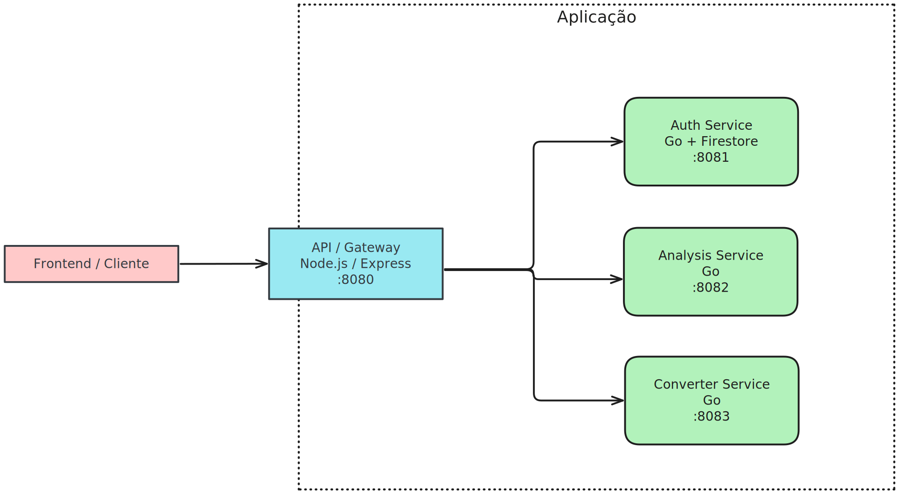

# Services with Gateway

Projeto de arquitetura de microsserviços com um API Gateway (Node.js) e três serviços em Go: autenticação, análises e conversões de arquivos. Orquestrado via Docker Compose.

## Visão Geral
- Gateway Express faz CORS, autenticação JWT, checagem de permissões e proxy transparente para os serviços.
- Serviço de Autenticação (Go + Firestore) gera tokens JWT com roles (permissões).
- Serviço de Análise (Go) processa arquivos SPED + XMLs e retorna resultados estruturados.
- Serviço de Conversão (Go) transforma diferentes formatos (CSV/XLS/XLSX) em CSV padronizado.



## Serviços e Portas
- Gateway: `8080` (externo: mapeado para a máquina host)
- Auth: `8081` (interno Docker)
- Analysis: `8082` (interno Docker)
- Converter: `8083` (interno Docker)

## Executando com Docker Compose
Pré‑requisitos:
- Docker e Docker Compose instalados
- Arquivos de ambiente e credenciais preparados (ver seções abaixo)

1) Preparar variáveis de ambiente
- `api-gateway/.env` (exemplo):
  ```env
  PORT=8080
  JWT_SECRET=troque-por-um-segredo-forte
  ALLOWED_ORIGINS=http://localhost:3000
  ```
- `service-auth/.env` (exemplo):
  ```env
  JWT_SECRET=troque-por-um-segredo-forte
  ```
  Observação: O `JWT_SECRET` do Auth e do Gateway PRECISAM ser idênticos.

2) Preparar credenciais do Firestore (somente Auth Service)
- Coloque o arquivo `credentials.json` na raiz do projeto (mesmo nível do `docker-compose.yml`).
- O Compose monta esse arquivo dentro do container do auth e setta `GOOGLE_APPLICATION_CREDENTIALS=/root/credentials.json`.

3) Subir os serviços
```bash
docker compose up -d --build
```

4) Verificar healthchecks
- Gateway: `GET http://localhost:8080/api/v1/health`
- Auth: `GET http://auth-service:8081/health` (de dentro da rede Docker) ou via logs
- Analysis: `GET http://analysis-service:8082/health`
- Converter: `GET http://converter-service:8083/health`

Para ver logs:
```bash
docker compose logs -f api-gateway auth-service analysis-service converter-service
```

## Fluxo de Autenticação e Autorização
1) Login no Auth Service via Gateway:
   - `POST http://localhost:8080/api/v1/login`
   - Body JSON: `{ "username": "<usuario>", "password": "<senha>" }`
   - Resposta: `{ "token": "<jwt>" }`
2) Enviar o token nas próximas requisições:
   - Header: `Authorization: Bearer <jwt>`
3) O Gateway valida o JWT (HS256 com `JWT_SECRET`) e checa a permissão necessária por rota (roles no claim `roles`).

### Permissões esperadas por rota (roles)
- `analise-icms` → `/api/v1/analyze/icms`
- `analise-ipi-st` → `/api/v1/analyze/ipi-st`
- `converter-francesinha` → `/api/v1/convert/francesinha`
- `converter-receitas-acisa` → `/api/v1/convert/receitas-acisa`
- `converter-atolini-pagamentos` → `/api/v1/convert/atolini-pagamentos`
- `converter-atolini-recebimentos` → `/api/v1/convert/atolini-recebimentos`

Os usuários/roles são buscados no Firestore (coleção `users`) pelo Auth Service.

## Endpoints do Gateway (proxy)
Base: `http://localhost:8080`

- `POST /api/v1/login` → Auth Service (sem autenticação)
- `POST /api/v1/analyze/icms` (JWT + `analise-icms`)
- `POST /api/v1/analyze/ipi-st` (JWT + `analise-ipi-st`)
- `POST /api/v1/convert/francesinha` (JWT + `converter-francesinha`)
- `POST /api/v1/convert/receitas-acisa` (JWT + `converter-receitas-acisa`)
- `POST /api/v1/convert/atolini-pagamentos` (JWT + `converter-atolini-pagamentos`)
- `POST /api/v1/convert/atolini-recebimentos` (JWT + `converter-atolini-recebimentos`)
- `GET /api/v1/health`

## Exemplos de Requisição (Pseudo)
Estes modelos descrevem método, URL, headers e payload. Use sua ferramenta preferida (Postman, Insomnia, código, etc.) para montar as requisições.

Login
- Método/URL: `POST /api/v1/login`
- Headers: `Content-Type: application/json`
- Body (JSON):
  - `username`: string
  - `password`: string
- Resposta esperada (JSON): `{ "token": string }`

Analyze / ICMS
- Método/URL: `POST /api/v1/analyze/icms`
- Headers:
  - `Authorization: Bearer <JWT>`
  - `Content-Type: multipart/form-data`
- Form-data:
  - `spedFile`: file (obrigatório)
  - `xmlFiles`: file (pode repetir múltiplos)
  - `cfopsIgnorados`: text (opcional, CSV: "5.101, 6.102")
- Resposta esperada: JSON com resultados da análise

Analyze / IPI-ST
- Método/URL: `POST /api/v1/analyze/ipi-st`
- Headers:
  - `Authorization: Bearer <JWT>`
  - `Content-Type: multipart/form-data`
- Form-data:
  - `spedFile`: file (obrigatório)
  - `xmlFiles`: file (pode repetir múltiplos)
- Resposta esperada: JSON com resultados da análise

Convert / Francesinha (Sicredi)
- Método/URL: `POST /api/v1/convert/francesinha`
- Headers:
  - `Authorization: Bearer <JWT>`
  - `Content-Type: multipart/form-data`
- Form-data:
  - `lancamentosFile`: file (.csv/.xls/.xlsx)
  - `contasFile`: file (.csv)
  - `classPrefixes`: text (CSV de prefixos)
- Resposta esperada: arquivo CSV (download)

Convert / Receitas ACISA
- Método/URL: `POST /api/v1/convert/receitas-acisa`
- Headers:
  - `Authorization: Bearer <JWT>`
  - `Content-Type: multipart/form-data`
- Form-data:
  - `excelFile`: file (.xls/.xlsx)
  - `contasFile`: file (.csv)
  - `classPrefixes`: text (CSV de prefixos)
- Resposta esperada: arquivo CSV (download)

Convert / Atolini Pagamentos
- Método/URL: `POST /api/v1/convert/atolini-pagamentos`
- Headers:
  - `Authorization: Bearer <JWT>`
  - `Content-Type: multipart/form-data`
- Form-data:
  - `lancamentosFile`: file (.xls/.xlsx)
  - `contasFile`: file (.csv)
  - `debitClassPrefixes`: text (CSV)
  - `creditClassPrefixes`: text (CSV)
- Resposta esperada: arquivo CSV (download)

Convert / Atolini Recebimentos
- Método/URL: `POST /api/v1/convert/atolini-recebimentos`
- Headers:
  - `Authorization: Bearer <JWT>`
  - `Content-Type: multipart/form-data`
- Form-data:
  - `lancamentosFile`: file (.xls/.xlsx)
  - `contasFile`: file (.csv)
  - `debitPrefixes`: text (CSV)
  - `creditPrefixes`: text (CSV)
- Resposta esperada: arquivo CSV (download)

## Variáveis de Ambiente
Gateway (`api-gateway/.env`):
- `PORT` (opcional, padrão `8080`)
- `JWT_SECRET` (obrigatório, igual ao do Auth)
- `ALLOWED_ORIGINS` (CSV de origens permitidas; use `*` apenas em desenvolvimento)

Auth Service (`service-auth/.env`):
- `JWT_SECRET` (obrigatório)
- Credenciais do Google via arquivo: `credentials.json` (montado pelo Compose) e `GOOGLE_APPLICATION_CREDENTIALS` já definido no `docker-compose.yml`.

Analysis / Converter: sem variáveis obrigatórias no padrão atual.

## CORS
- Configurado no Gateway com `cors`.
- Define origem permitida a partir de `ALLOWED_ORIGINS` (lista separada por vírgulas). Aceita requisições sem origem (ex.: curl) e o coringa `*`.

## Desenvolvimento Local (sem Docker)
- Gateway (Node 20):
  ```bash
  cd api-gateway
  npm install
  # Ajuste os alvos no código se quiser apontar para localhost (linhas comentadas em index.js)
  npm start
  ```
- Serviços Go: rodar cada um com Go 1.21+ (ou compatível com o Dockerfile de build):
  ```bash
  cd service-auth && go run ./cmd/auth
  cd service-analysis && go run ./cmd/analysis
  cd service-converter && go run ./cmd/converter
  ```
  Obs.: para o Auth local, exporte `JWT_SECRET` e configure o Firestore com as credenciais (`GOOGLE_APPLICATION_CREDENTIALS`).

## Estrutura do Repositório
```
.
├─ docker-compose.yml
├─ api-gateway/
│  ├─ index.js
│  ├─ authMiddleware.js
│  ├─ Dockerfile
│  └─ package.json
├─ service-auth/
│  ├─ cmd/auth/main.go
│  ├─ internal/api/handlers/auth_handler.go
│  ├─ internal/core/auth/service.go
│  └─ Dockerfile
├─ service-analysis/
│  ├─ cmd/analysis/main.go
│  ├─ internal/api/handlers/analysis_handler.go
│  └─ Dockerfile
└─ service-converter/
   ├─ cmd/converter/main.go
   ├─ internal/api/handlers/converter_handler.go
   └─ Dockerfile
```

## Erros e Respostas
- Gateway retorna `401` para token ausente/inválido e `403` para falta de permissão.
- Serviços retornam erros padronizados via helpers `responses` (JSON com mensagem e, em alguns casos, detalhes).
- Converter retorna CSV em sucesso com header `Content-Disposition` para download.

## Dicas e Solução de Problemas
- Tokens inválidos: garanta que `JWT_SECRET` do Auth e do Gateway são exatamente iguais.
- CORS bloqueado: ajuste `ALLOWED_ORIGINS` para incluir a origem do seu frontend (ex.: `http://localhost:3000`).
- Firestore: verifique `credentials.json` na raiz e permissões do serviço. O container do Auth usa `/root/credentials.json` via volume.
- Inicialização: `depends_on` não aguarda saúde dos serviços; se necessário, re‑tente a chamada após alguns segundos.
- Uploads grandes: use `-F` em `curl` para multipart; confirme os nomes de campo exatamente como descritos nos handlers.

## Segurança
- Nunca commitar `credentials.json` nem `.env` com segredos reais.
- Em produção, defina origens específicas em `ALLOWED_ORIGINS` (evite `*`).
- Considere rotação periódica do `JWT_SECRET` e expiração adequada (atual: 24h).

---
